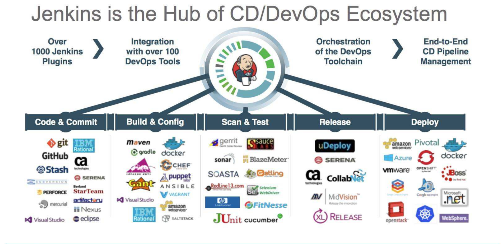
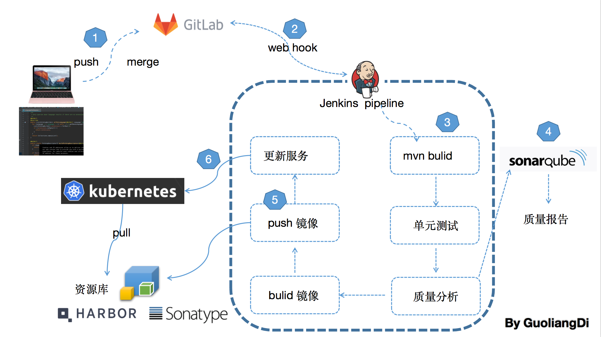

<h1 align="center">CI/CD 持续集成</h1>

## 介绍

基于Gitlab + Jenkins + Harbor + Sonarqube + Docker + Kubernetes 完成可持续集成与可持续交付解决方案

`springcloudFeign` 是一个可持续集成的demo架构，基于spring cloud技术栈

## 可持续集成示意图

## 可持续集成生态图

## 实现目标

### 技术选型
* jdk1.8
* gitlab
* jenkins
* sonarqube
* harbor & nexus3 & artifactory (本示例采用harbor)
* docker
* kubernetes

### Tutorials Prerequisites（准备环境）:

- A machine with:
- linux environment `centos7`
- 256 MB of RAM, although more than 512MB is recommended
- 10 GB of drive space (for Jenkins and your Docker image)
- The following software installed:
- `Java 8` (either a JRE or Java Development Kit (JDK) is fine)
- Docker (navigate to Get Docker at the top of the website to access the Docker download that’s suitable for your platform)

### Getting started（安装环境）:
[安装docker](bootstrap/install-docker.md) 

[安装gitlab](bootstrap/install-gitlab.md) 

[安装jenkins](bootstrap/install-jenkins.md) 

[安装sonarqube](bootstrap/install-sonarqube.md) 

[安装harbor](bootstrap/install-harbor.md) 

[安装kubernetes](bootstrap/install-kubernetes.md) 

### 运行教程  <---- 
[点我查看运行教程](https://github.com/guoliangd/springcloudFeign/wiki)

## If you have a better suggestion,Please share out,Let's do better.
> Author ：GuoliangDi  
> Email  ：guoliang.di@gmail.com